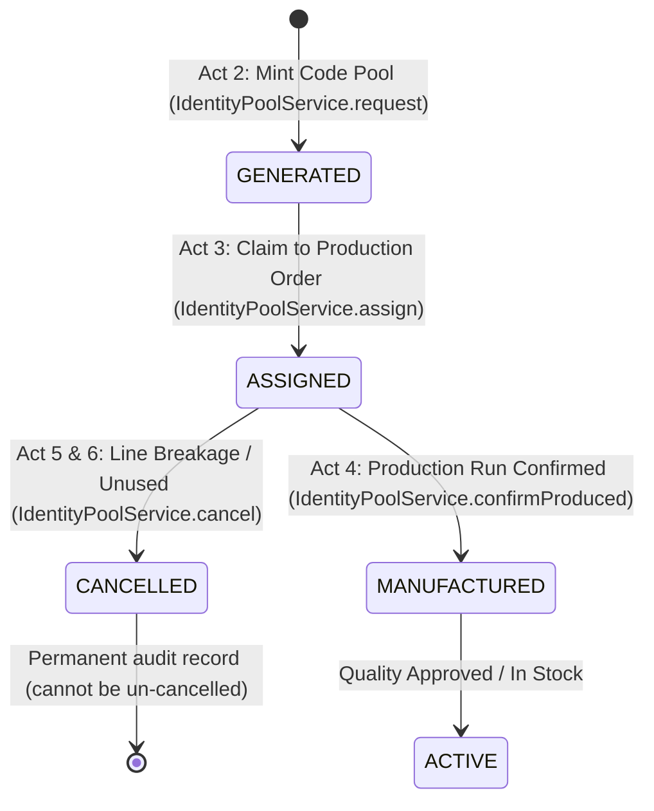

# DR-08: Identity Pool Decoupling and Production Lifecycle

## Context & Problem Statement

In the initial architecture, a unit's permanent QR identity was minted at the moment of unit registration. This created an operational dilemma in manufacturing facilities:
1. **Pre-printing dilemma:** A factory must print physical label rolls before sticking them on products along high-speed production lines (e.g. 10,000 bottles of Akagera Water).
2. **False inventory:** If minting labels directly creates inventory rows, requesting 10,000 codes immediately inflates warehouse stock before any goods are manufactured.
3. **Scrap & defects:** On every production line, bottles break, caps fail inspection, or labels misprint. Under the old model, scrap could not be properly tracked against pre-printed rolls without corrupting inventory balance.
4. **Postgres batch limit:** Postgres caps bind parameters at 65,535. Inserting 10,000 events (17 columns each = 170,000 parameters) fails at database driver level without internal chunking.

---

## Decision

We separate **minting a code** from **producing the product it names**. A code is not a bottle. A pool of identities is a print run of labels; stock is created only when production confirms real physical output.

### The 6-Act Lifecycle

1. **Act 1 (Baseline):** Stock before any run is 0.
2. **Act 2 (Pool Minting):** Mint $N$ identities (`IDENTITY_GENERATED`). Stock remains 0. Polling tracks minting progress.
3. **Act 3 (Order Assignment):** A production order claims codes from a ready pool (`IDENTITY_ASSIGNED`). Stock remains 0.
4. **Acts 5 & 6 (Cancellation & Scrap):** Any defective units or unused labels are cancelled with explicit reasons (`PRODUCTION_DEFECT`, `LABEL_UNUSED`, `LABEL_DAMAGED`, `MISPRINT`, `OTHER`). Stock remains 0. Re-cancellation is refused.
5. **Act 4 (Production Confirmation):** When the run finishes, confirmed units move to `MANUFACTURED` and enter stock. `producedQuantity` is derived directly from confirmed identities.

---

## Reconciliation Invariant

Every pool adheres to the construction invariant:

$$\text{minted} = \text{produced} + \text{cancelled} + \text{awaitingProduction}$$

No figures are estimated or guessed.

---

## Postgres Chunking Fix

Bulk database operations for identity events chunk at 1,000 rows per batch ($1,000 \times 17 = 17,000 < 65,535$), ensuring large print runs (10,000+ codes) execute reliably without parameter overflow.

---

## Navigation & UI Consolidation

Navigation is structured around destinations rather than verbs:
- **Products (`/dashboard/products/[id]`):** Details · Identities & Pools · Batches · Labels.
- **Production (`/dashboard/manufacturing/production`):** Orders · Start Run Wizard · Assign Pool · Cancel Defect Codes · Confirm Output.
- **Resources (`/dashboard/manufacturing/resources`):** Machines · Raw Materials · Bills of Materials.
- **Global Scan:** Persistent header action for instant scanning across all screens.
