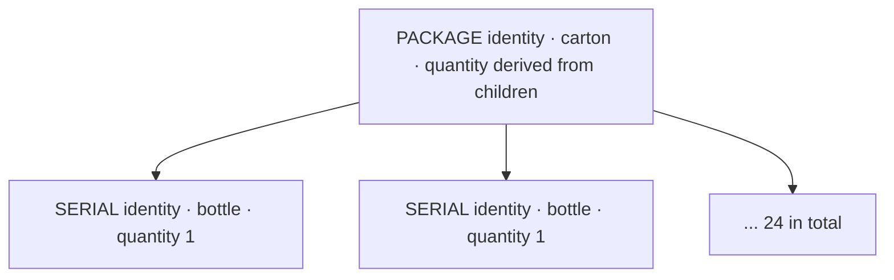

# DR-09: Sales Units, Identity Granularity and the Sales MVP Boundary

**Status:** APPROVED — D1, D2, D3 signed 25 Aug 2026. No code, schema, migration or frontend
has been written under this DR.

**Implementation contract:** `DR-09-implementation-contract.md`.

**Depends on:** DR-01 (traceability level), DR-08 (identity pool and decoupled lifecycle).

---

## Context & Problem Statement

A current-state audit of the commercial layer found that SANTRACK is not missing a sales
system. It has two, and they do not know about each other:

- `src/sale/` moves physical identities. `SaleService.sell()` gates on the whole containment
  tree, writes `SOLD` events, and for a business sale raises a `Transfer`.
- `src/commerce/` is the paper trail: Customer → Quotation → SalesOrder → Invoice → Payment
  → SalesReturn, with transition guards and FEFO reservation.

Neither is the problem this DR exists for. The problem is one question underneath both,
which nothing in the codebase had answered:

> A customer asks for 500 bottles. The warehouse holds one identity carrying 10,000. What
> does the system do?

Three facts make this harder than it looks.

1. **There is no split operation anywhere.** A `UNIT` identity's `quantity` is written once
   by `unitsPerIdentity()` at registration and is never mutated by any code path.
   `refreshQuantities()` recomputes `quantity` only where `isPackage()` is true, and only by
   summing children. `removeUnit()` detaches an existing child; it cannot manufacture one.
   A `BATCH`-traced identity carrying 10,000 bottles is therefore **atomic and indivisible**.
2. **The reservation code assumes otherwise.** `SalesOrderService.reserveLine()` requires
   `available.length >= needed` and hard-codes `quantity: 1` on each reservation row. That is
   correct only under `SERIAL`. For a `BATCH`-traced product it compares a count of lots
   against a count of bottles.
3. **The two stock-in doors disagree about what a traceability level means.**
   `ItemService.registerUnits()` honours `unitsPerIdentity()`. `IdentityPoolService.mintChunk()`
   hard-codes `quantity: 1` and never reads `product.traceabilityLevel`. Request a pool of
   10,000 codes for a `BATCH`-traced product and you get 10,000 one-bottle identities — the
   exact opposite of what `BATCH` declares.

Fact 1 is the one everything else follows from. The reservation code is not doing bad
arithmetic on a divisible thing; it is being asked to divide something the model has no way
to divide.

---

## Decision

### D1 — Identity granularity for cased goods

**Cased goods are modelled as one `SERIAL` identity per unit, packed into `PACKAGE`
container identities.** `TraceabilityLevel.BATCH` is reserved for genuinely bulk goods,
where the lot really does move as one object.

The demo this MVP exists to make work ends with *"the shop sells one bottle"* and *"the
consumer scans that bottle"*. Those two lines rule out case-level and lot-level granularity
on their own: if the carton is the smallest identity there is no bottle QR to scan and
nothing the shop can sell singly. Loose serials alone are ruled out in the other direction —
a distributor cannot scan 2,016 codes to accept a delivery.

Every operation this needs already exists and is already correct: `pack()` sets the child's
holder and location from the container, `withDescendants()` makes contents travel with it,
`refreshQuantities()` keeps the carton's count honest as bottles leave, and `InventoryService`
counts leaves only so a packed carton and its bottles are never double-counted.

**Accepted cost:** a 10,000-bottle run mints 10,000 labels. That is the price of per-unit
traceability, and it is now a deliberate charge rather than an accident.

### D2 — Sales unit, requested quantity, fulfilment quantity

**The customer's request is preserved exactly. Rounding produces a second figure alongside
it, never a replacement.**

An earlier draft rounded the order at entry, overwriting 2,000 with 2,016. That was rejected:
the requested quantity is the customer's own statement of what they wanted, and it is the
number every later dispute, credit note and delivery discrepancy is argued against. Once
overwritten it is not recoverable from anywhere.

An order line therefore carries three facts:

| Field | Example | Meaning |
| --- | --- | --- |
| `salesUnit` | `BOTTLE` | The commercial unit the deal was struck in. Snapshot on the line, like `unitPrice`. |
| `requestedQuantity` | 2,000 | What the customer asked for. Written once, never recalculated. |
| `fulfilmentQuantity` | 2,016 | Product units required to satisfy it with whole identities. Null until confirmation. |
| *derived* | 84 | Identity count. Never stored on the line; it is the `SalesOrderReservation` rows. |

The UI states both: **"2,000 bottles requested → 84 cartons / 2,016 bottles to fulfil"**.
Where the business rule needs the customer to wear the difference, that acceptance is
explicit and recorded before confirmation, never inferred from silence.

Rounding occurs only when the sales unit is finer than the identity granularity. Order in
`CARTON` and requested equals fulfilment exactly — there is nothing to accept and nothing to
explain.

### D3 — Opening stock for non-manufacturers

**Out of scope for the pilot. `REGISTER_IDENTITY` stays manufacturer-only.**

Every pilot participant is fed by a SANTRACK manufacturer, so all stock enters the chain at
production and reaches everyone else by transfer. Minting an identity remains a manufacturing
claim and no other organization type may make it.

**Known debt.** A distributor with existing shelves cannot join without this. It is
unavoidable before a real pilot and must be raised as its own decision then — likely a
distinct capability that mints identities explicitly marked declared-not-manufactured, and
never a widening of `REGISTER_IDENTITY`.

---

## The governing rule

> **Sell in commercial units, measure stock in product units, move and reserve whole
> traceable identities. Never split an identity.**

Three layers, three vocabularies, and the conversions between them stay visible rather than
collapsed:

| Layer | Unit | Example | Who speaks it |
| --- | --- | --- | --- |
| Commercial | `salesUnit` | 84 `CARTON`, or 2,000 `BOTTLE` | Customer and salesperson. Priced in this unit. |
| Product | `baseUnit` | 2,016 bottles | Stock. What `TraceableItem.quantity` counts and `InventoryService` sums. |
| Physical | `TraceableItem` | 84 `PACKAGE` identities | Warehouse and event log. Indivisible. |

---

## The unit model is deliberately minimal

Not a unit-of-measure engine. A product declares its base unit and, optionally, **one** pack
that wraps it:

| Column | Type | Example |
| --- | --- | --- |
| `baseUnit` | varchar, nullable | `BOTTLE` — what `TraceableItem.quantity` counts |
| `packUnit` | varchar, nullable | `CARTON` — a pack is as often a bag, crate or pallet as a case |
| `unitsPerPack` | int, nullable | 24 — the single conversion the MVP knows |

**A line's `salesUnit` must be either the product's `baseUnit` or its `packUnit`. Nothing
else is accepted.** One conversion, one direction, validated at line entry. `packUnit` and
`unitsPerPack` are set together or not at all.

None of these three columns is stock truth. A real carton's `quantity` continues to come
from its children via `refreshQuantities()`, and the last carton of a run legitimately holds
fewer than a full pack.

### Sales unit availability is conditional

Appearing in the vocabulary is not the same as being sellable. A sales unit is valid only if
it is compatible with that product's base unit **and** its traceability model. The check
belongs at line entry, where it can be explained, not at confirmation, where it arrives as a
failure after the customer has been quoted.

| Traceability | Valid `salesUnit` | Fulfilment |
| --- | --- | --- |
| `SERIAL` | `baseUnit`, or `packUnit` where one is declared | Whole identities. Rounds up when the sales unit is finer than the identity. |
| `PACKAGE` | As `SERIAL`. The pack is the atom, so `baseUnit` orders always round. | Whole identities. |
| `BATCH` | `baseUnit` only, and the requested quantity must equal the whole lot. | **Partial fulfilment refused** until a split operation exists. |

This closes the continuous-unit question rather than special-casing it. `KG`, `LITRE` and
`METRE` are legitimate *base* units; a product measured in them is bulk, which under D1 is
`BATCH`-traced, so it lands in the third row and inherits the refusal.

**Partial `BATCH` fulfilment is unsupported.** It must be refused with that sentence rather
than by a confusing insufficient-stock error. Selling a part-lot of bulk is the deferred
split decision wearing a different hat, and it must not be smuggled in through the sales-unit
list.

---

## Invariants

1. A `UNIT` identity's `quantity` is never mutated by any sales code path.
2. `requestedQuantity` is written once at line creation and never recalculated.
3. `fulfilmentQuantity` is null until confirmation, and thereafter equals
   `SUM(TraceableItem.quantity)` over that line's reservations.
4. `salesUnit` is either the product's `baseUnit` or its `packUnit`; no other value is
   accepted at line entry.
5. `packUnit` and `unitsPerPack` are both set or both null. `unitsPerPack >= 2`.
6. A `BATCH`-traced line whose requested quantity is less than the lot's own quantity is
   refused at entry, naming the reason.
7. `baseUnit`, `packUnit` and `unitsPerPack` are never read by a stock, reservation or
   inventory query.
8. Reservation reserves whole identities only. A line is covered when accumulated
   `SUM(quantity)` reaches `requestedQuantity`.
9. Cancelling or releasing an order returns every reserved identity to `ACTIVE` and appends
   an event. Reservation rows are not deleted — the log is append-only.
10. Invoicing and payment gate no custody transition. The chain is demonstrable end to end
    with nothing paid.

---

## Scope lock

**Payment sits outside the physical movement acceptance criteria.** Invoicing and payment are
a parallel commercial record. Folding them into the movement criteria would make an unpaid
invoice look like a traceability failure. They get their own acceptance criteria when the
Important tier is built.

**Explicit non-goals for this DR:** a unit-of-measure conversion engine; multi-level pack
hierarchies (bottle → carton → pallet as three sellable tiers); per-customer units; weight- or
volume-derived pricing; price lists, tiers, discounts, promotions, currency or tax codes;
point of sale; purchasing and suppliers; backorders and split shipments; ledger posting;
commission and territories.

If a second pack tier is needed later it is a decision, not a schema afterthought.

---

## Sign-off

| Decision | Status | Date |
| --- | --- | --- |
| D1 — SERIAL units inside PACKAGE containers | ☑ SIGNED as proposed | 25 Aug 2026 |
| D2 — sales unit / requested / fulfilment kept separate | ☑ SIGNED as revised | 25 Aug 2026 |
| D3 — opening stock out of scope, `REGISTER_IDENTITY` unchanged | ☑ SIGNED as proposed | 25 Aug 2026 |
